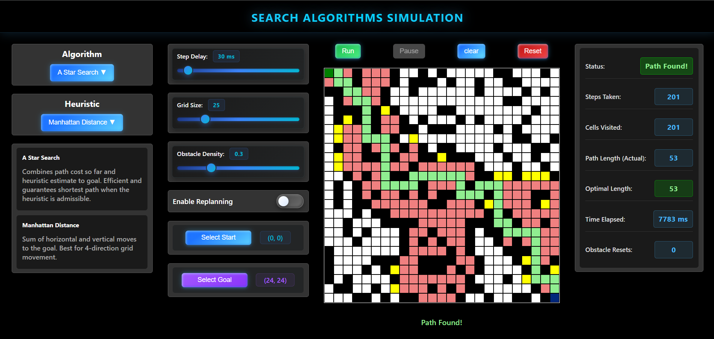
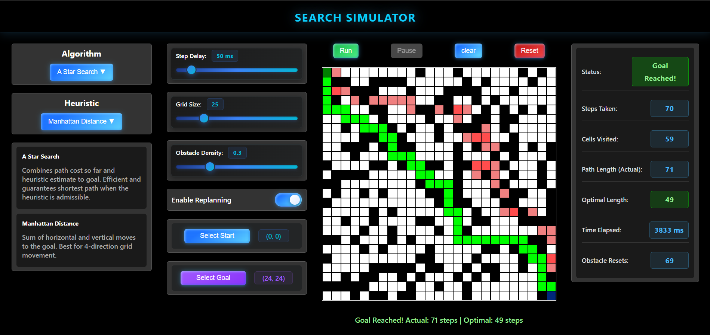

# Search Simulations

An interactive web-based visualizer for exploring various pathfinding algorithms on a grid.

## Overview

This simulator demonstrates how different search algorithms navigate from a start point to a goal on a grid with obstacles. Watch in real-time as algorithms explore the environment, and compare their efficiency, path length, and exploration patterns.

## Algorithms

- **DFS** (Depth First Search) - Explores deep along one path before backtracking. Memory-efficient but doesn't guarantee shortest path.
- **BFS** (Breadth First Search) - Explores level by level. Guarantees shortest path in unweighted grids.
- **UCS** (Uniform Cost Search) - Expands lowest-cost paths first. Guarantees optimal path with non-negative costs.
- **Greedy** (Best First Search) - Uses heuristic to estimate closeness to goal. Fast but not guaranteed shortest.
- **A\*** (A Star Search) - Combines path cost and heuristic estimate. Efficient and optimal with admissible heuristics.

## Features

- Interactive grid-based simulation environment
- Multiple pathfinding algorithms to compare
- Different heuristics (Euclidian, Manhattan, Chebyshev)
- Real-time visualization of algorithm exploration
- Configurable grid size, obstacles, and start/goal positions
- Pause/resume and speed controls

## Demo Screenshots

Here are some screenshots of the simulator in action:

### Screenshot 1

### Screenshot 2

## Getting Started

1. Open `index.html` in your web browser
2. Set your grid parameters and starting/goal positions
3. Select an algorithm and heuristic
4. Click start to visualize the pathfinding process

## Files

- `app.js` - Main application logic
- `pathFinder.js` / `pathFinderDynamic.js` - Algorithm implementations
- `minHeap.js` - Priority queue for algorithms like A*
- `script.js` - UI interactions and controls
- `index.html` - Web interface
- `style.css` - Styling
- `constants.js` - Algorithm definitions and configurations
- `settings.js` - Simulation settings
- `utils.js` - Utility functions
